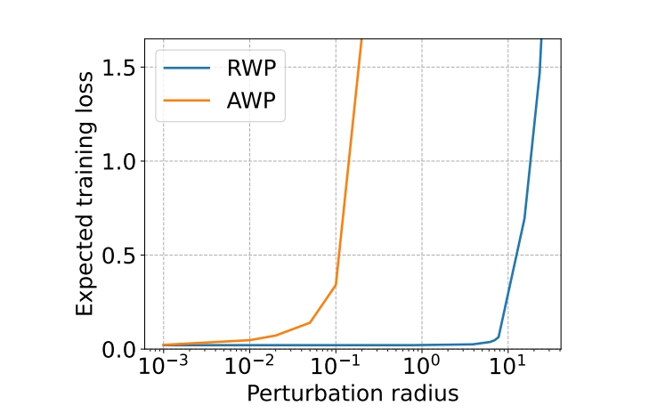

# Revisiting Random Weight Perturbation for Efficiently Improving Generalization

The code is the official implementation of our TMLR 2024 paper 
[Revisiting Random Weight Perturbation for Efficiently Improving Generalization](https://openreview.net/pdf?id=WbbgOHpoPX).  A short version is on NeurIPS Workshops on Optimization for Machine Learning (2023).

In this work, we enhance the generalization performance of random weight perturbation from the perspective of convergence and perturbation generation, and shows that it can achieve more efficient generalization improvement than adversarial weight perturbation in SAM, with comparable or even betteer performance.



## Dependencies

Install required dependencies:

```
pip install -r requirements.txt
```

## How to run
We show sample usages in `run_rwp.sh`, `run_mrwp.sh` and `run_mrwp_ddp.sh`.

For 1x computational cost version by incoperating our adaptive perturbation generation, run 

```
bash run_rwp.sh
```
For 2x computational cost version by incoperating our mixing loss objective and adaptive perturbation generation, run 

```
bash run_mrwp.sh
```
If you have more than one GPU, the training can be parallelized by
```
bash run_mrwp_ddp.sh
```

## Citation
If you find this work helpful, please cite:
```
@article{li2024revisiting,
  title={Revisiting Random Weight Perturbation for Efficiently Improving Generalization},
  author={Li, Tao and Tao, Qinghua and Yan, Weihao and  Lei, Zehao and Wu, Yingwen and Fang, Kun and He, Mingzhen and Huang, Xiaolin},
journal={Transactions on Machine Learning Research (TMLR)},
  year={2024}
}
```
